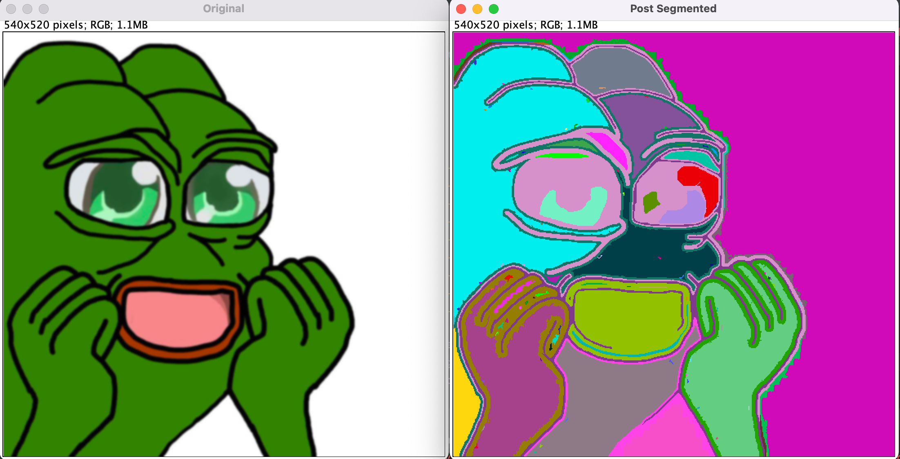
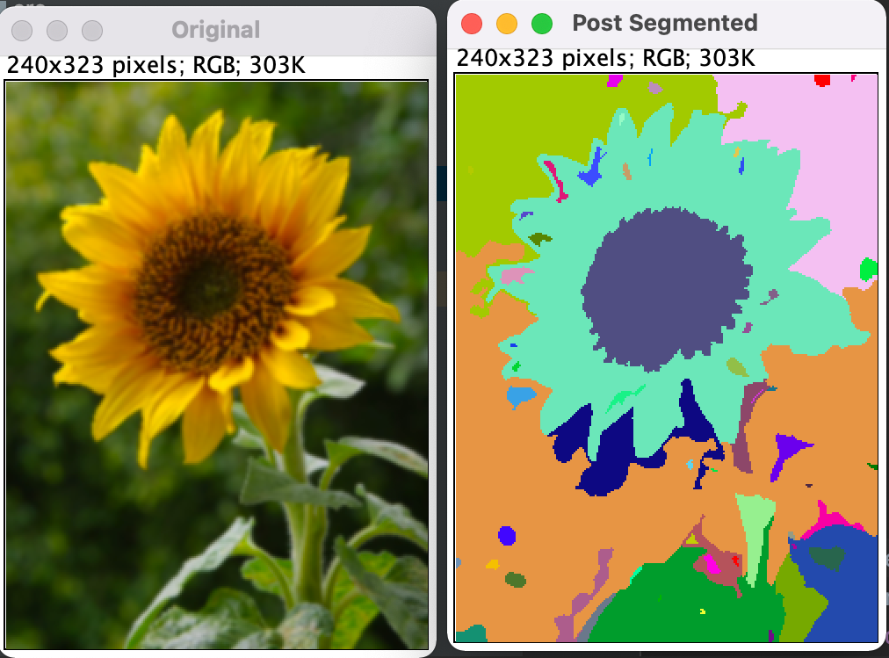

# Felzenszwalb Image Segmentation 
Implementation of Felzenszwalb’s Image Segmentation Algorithm using an efficient graph based approach as described in the original academic literature 
[http://cs.brown.edu/people/pfelzens/papers/seg-ijcv.pdf] featured in the International Journal of Computer Vision (IJCV) in 2004 by Pedro F. Felzenszwalb and Daniel P. Hutenlocher.

### Results

